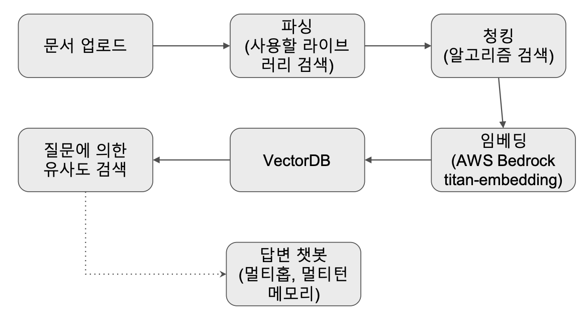

## RAG 챗봇 개인과제 정의


RAG 기반 챗봇 구현. 사내문서는 삼성 건강보험(올인원 암보험) 관련 문서. 

### 핵심으로 잡은 세 가지 
- LangSmith로 디버깅, 모니터링하며 Tracing을 통해 병목현상이나 개선 부분 도출
- 비용 및 성능 지표를 수립해 데이터 기반으로 문서화
- 문서가 짧고 정형 텍스트라(사진없음) 무거운 외부 도구가 필요 없음. 표·계층 구조 보존 필요. 만약 사진이 있었으면? LlamaParse(OCR + 표 구조 복원) 또는 AWS Textract

### 진행순서
1. 문서 업로드 -> 파싱

### PyMuPDF
문서 표는 총 3개 (3페이지 2개, 6페이지 1개). 페이지 수 대비 표 밀도가 높진 않지만, 뽑아보니 구조가 깨짐
3페이지 "보험기간" 표를 PyMuPDF로 뽑은 결과
```
'1종(일시지급형)[순수보장형] 최초 1종(일시지급형) 계약 [만기지급형] 2종(생활자금형)[순수보장형]'  ← 한 셀에 다 뭉침
'15 ~ 77세\n15 ~ 60세\n15 ~ 78세'  ← 세 행이 한 셀에 합쳐짐
```
원본은 "1종 순수보장형 = 남자 15~77세", "1종 만기지급형 = 남자 15~60세"처럼 행마다 나이가 다른데, 
PyMuPDF가 **병합 셀(merged cell)**을 못 풀어서 "15~77 / 15~60 / 15~78"을 한 칸에 출력. 이러면 "1종 만기지급형 남자 가입나이?" 물어봤을 때 챗봇이 77인지 60인지 구분하지 못할 가능성 큼.

### 병합 셀 + 다단 헤더(2줄짜리 헤더)
1순위 — pymupdf4llm (같은 PyMuPDF 계열, 마크다운 출력)
PyMuPDF 레이아웃 강화 패키지로 표를 마크다운으로 뽑아주고 기본 find_tables보다 병합/헤더 처리가 우수함. PyMuPDF 쓰는 설계라 의존성 추가가 거의 없어서 1순위. 무료·로컬도 유지돼.
2순위 — Camelot 또는 pdfplumber (표 전문 추출기)
표만큼은 격자선(lattice) 기반으로 정밀하게 떠줌. Camelot은 선이 그려진 표(이 문서가 격자 있음)에 특히 강해. 다만 표 3개만 잡으면 되니까 "표 페이지(3,6)만 Camelot으로, 나머지 평문은 PyMuPDF로" 식의 이중 파이프라인이 돼서 코드 증가.
3순위 — LlamaParse / Upstage Document Parse
병합 셀·다단 헤더를 LLM이 알아서 정형화. 가장 깔끔하지만 외부 API라 앞에서 말한 비용·재현성 이슈. 단 **Upstage(한국 회사)**는 한국어 문서·표에 특화돼서 이런 한글 보험 표엔 정확도가 제일 높을 가능성이 큼. Bedrock 고집 안 하면 후보로 좋다.

이 문서엔 PyMuPDF(평문) + pymupdf4llm 또는 Camelot(표 3개 전용) 조합.
표가 병합 셀이라 단순 추출은 깨진다. 근데 표가 3개뿐이라 전체를 외부 API에 맡길 필요는 없고, 표 페이지만 전용 추출기로 처리하면 비용 없이 정확도 확보.
깨진 결과 vs 살린 결과 비교
### 병합셀이란?
┌────────┬──────────┬────────┬─────────────────┬────────┐
│  구분   │  보험기간  │ 납입기간 │   가입나이        │ 납입주기 │
│        │          │        ├────────┬────────┤        │
│        │          │        │  남자   │  여자   │        │   ← 헤더가 2줄
├────────┼──────────┼────────┼────────┼────────┼────────┤
│ 1종     │          │        │ 15~77세 │ 15~80세 │        │
│ 순수보장 │          │        │        │        │        │
├────────┤          │        ├────────┼────────┤        │
│ 1종     │   15년    │  전기납  │ 15~60세 │ 15~68세 │  월납   │
│ 만기지급 │  ←합쳐짐  │ ←합쳐짐 │        │        │ ←합쳐짐 │
├────────┤          │        ├────────┼────────┤        │
│ 2종     │          │        │ 15~78세 │ 15~80세 │        │
└────────┴──────────┴────────┴────────┴────────┴────────┘

세로 병합 — "보험기간(15년)", "납입기간(전기납)", "납입주기(월납)"는 1종·만기지급·2종 세 행에 걸쳐 한 칸으로 합쳐져 있다. 

다단 헤더(가로 병합 비슷한 구조) — "가입나이"라는 큰 제목 아래에 "남자/여자"가 들어가서 헤더가 2층 구조.

### 병합셀의 문제
사람 눈으론 병합셀을 시각적으로 구분할 수 있지만 PyMuPDF 같은 기본 추출기는 병합 셀을 못 풀어서, 합쳐진 칸의 값을 어느 행에 줘야 할지 모른다.
그래서 이런 결과를 도출: '15 ~ 77세\n15 ~ 60세\n15 ~ 78세'   ← 세 행 나이가 한 칸에 다 뭉침
이러면 챗봇이 "1종 만기지급형 남자 가입나이가 몇 살이에요?" 물었을 때 77인지 60인지 매칭을 하지 못함. 표의 행-열 관계가 깨짐.
따라서 병합 셀을 제대로 풀어주는 도구(pymupdf4llm, Camelot, Upstage 등)가 필요하다.